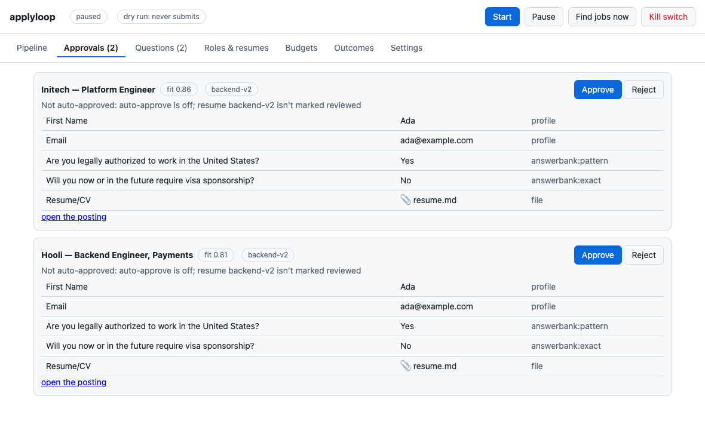
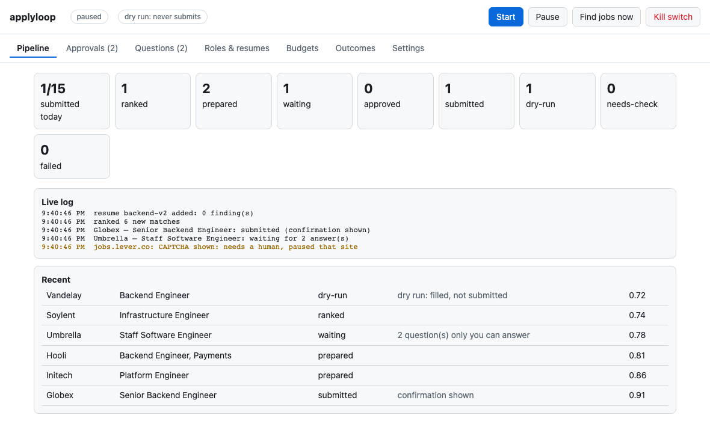

<h1 align="center">applyloop</h1>

<p align="center">
  <em>It applied while I slept, then told me what I lack, from my own rejections.</em>
</p>

<p align="center">
  <a href="https://github.com/sandeepsirodia/applyloop/actions/workflows/ci.yml"></a>
  
  
  
</p>

---

<p align="center"></p>

<p align="center"><sub>Screenshots use synthetic data (Ada Lovelace, fictional companies).</sub></p>

A local job-search agent. It finds openings that fit your resume, fills each application **in your own Chrome**, asks you each screening question **once**, submits at a human pace (or waits for your approval), and then reads the replies to tell you what's working. Everything runs on your machine.

Most "auto-apply" bots brag about volume. applyloop is built around the opposite idea: **a few good applications, measured.**

## The loop

| Step | Done by | What happens |
|---|---|---|
| **Find** | [whatshiring](https://github.com/sandeepsirodia/whatshiring) | Public job boards (Greenhouse, Lever, Ashby, RemoteOK), ranked against your resume with a score you can read. On a slow day it widens to roles you accepted, then to a lower fit floor, and says "only 4 good matches today" instead of padding. |
| **Read your resume** | built in | PDF, DOCX, Markdown or JSON Resume. It shows what a parser loses (columns read out of order, contact details only in the page header, letter-spaced headings), and nothing is used until you mark it reviewed. |
| **Fill** | Playwright + [answerbank](https://github.com/sandeepsirodia/answerbank) | Contact fields come from your resume. Screening questions come from answers you gave once. Anything new goes to the **Questions** tab and waits for you. Facts are never invented. |
| **Approve** | you, or rules you set | Manual by default. Auto-approve only when every rule holds: fit ≥ threshold, no unanswered or drafted answers, not applied there recently, resume reviewed, under the daily cap. There's a **kill switch**. |
| **Submit** | [ratekeeper](https://github.com/sandeepsirodia/ratekeeper) | Per-site pacing and quiet hours. A CAPTCHA or a logout pauses that site until you deal with it; it's never solved or bypassed. |
| **Learn** | [ghosted](https://github.com/sandeepsirodia/ghosted) | Reads your replies locally. It reports when to stop waiting, which resume version works, and which skills show up in the jobs that went nowhere. |

It starts **paused and in dry-run mode**: forms are filled and screenshotted, never submitted, until you switch dry run off.

## On a real form

A dry run against a live Greenhouse application page (Affirm, Sept 2026), with synthetic data:

```
FILLED   First Name, Last Name, Preferred Name, Email, Phone, LinkedIn       from the resume
FILLED   Are you legally authorized to work in the United States?  → Yes     answerbank (pattern)
FILLED   Do you now or in the future require sponsorship …?        → No      answerbank (pattern)
FILLED   Resume/CV                                                           uploaded
ASK YOU  Pronouns · U.S. State or Canadian Province · How did you first learn about Affirm? · …
```

Nothing was submitted. Each "ask you" question is asked once; the next form that asks it gets the answer automatically.

## Your Chrome, your logins, no password handling

- applyloop drives a real Chrome window. By default it uses a dedicated profile folder (`~/.applyloop/chrome`): log into your sites there once, and Chrome's own password manager fills logins from then on. Since Chrome 136, automation can't attach to Chrome's *default* profile folder, which is why it's a separate folder.
- **Any profile:** `--profile-dir` points at any Chrome user-data folder, and `--cdp-url` attaches to a Chrome you started yourself with `--remote-debugging-port`.
- **Never:** reading Chrome's password store, cookies or keychain; typing a password; solving a CAPTCHA. A login page or a challenge pauses that site and asks you.

## Try it

```bash
pip install "applyloop[pdf]"
python -m playwright install chromium

applyloop init --resume ~/resume.pdf --roles "backend engineer, platform engineer"
whatshiring fetch                   # public job boards, ~5 minutes, polite
applyloop ui                        # opens the local UI: paused, dry run
```

Want to look first? `python examples/demo_ui.py` opens the UI on synthetic data with nothing to install beyond the package.

**Models are optional and local.** Essay questions ("Why do you want to work here?") can be drafted by a local model through Ollama or any OpenAI-compatible endpoint. Drafts are marked, shown to you, and never auto-approved unless you allow it. No cloud model is used unless you configure one.

## The UI

`applyloop ui` serves one page on `127.0.0.1`, with a random token per session. It refuses requests without the token, or from another origin or host name (DNS rebinding).

- **Pipeline:** live counts and log.
- **Approvals:** every answer, where it came from, a screenshot of the filled form, and why it wasn't auto-approved.
- **Questions:** the new ones, answered once.
- **Roles & resumes:** add roles, accept suggested adjacent roles, upload resume versions and see what a parser loses from each.
- **Budgets:** per-site pacing; pause or resume a site.
- **Outcomes:** ghosted's report.
- **Settings:** dry run, auto-approve, thresholds, caps.

Job titles and form questions come from other people's pages, so the page never turns them into HTML: every element is built with `textContent`.

<p align="center"></p>

## Built to be interrupted

Every stage is saved to SQLite (`~/.applyloop/applyloop.sqlite`). Kill it at any point and start again: it continues where it stopped. A crash *during* a submit marks that job **needs-check**, and it is never submitted twice.

## What it won't do

- **LinkedIn Easy Apply,** or any site whose terms forbid automation.
- **Unlimited volume:** the default cap is 15 a day. You can raise it, but a few well-matched applications, measured, is the whole idea.
- **CAPTCHAs, proxies or fingerprint tricks.**

## Prior art

- **[AIHawk](https://github.com/chindris-mihai-alexandru/Jobs_Applier_AI_Agent_AIHawk)** (and its many forks) and **[ApplyPilot](https://github.com/Pickle-Pixel/ApplyPilot)** (AGPL) apply at volume with an LLM writing answers, including LinkedIn. applyloop is local-first, approval-first, never lets a model state a fact about you, and measures outcomes.
- **Autofill extensions** ([Simplify](https://simplify.jobs), [avid-autofill](https://github.com/athervvidhate/avid-autofill), [job_app_filler](https://github.com/berellevy/job_app_filler)) fill forms while you click. applyloop adds finding, approval rules, pacing and the outcome loop.
- **[OpenResume](https://github.com/xitanggg/open-resume)** has the original "what the parser sees" page; applyloop's resume check is a smaller version inside the loop.

## Honest limits

- **Forms vary.** One label-driven reader covers the four shapes seen on real Greenhouse, Lever and Ashby forms and on plain HTML forms. Workday-style multi-page wizards aren't supported yet. Anything it can't read with confidence waits for you rather than being guessed.
- **The first days are mostly questions.** That's the point, but it's slower than a bot that makes answers up.
- **Outcome statistics need volume:** ghosted says "not enough data yet" until you have about 20 applications and 5 replies.

## License

MIT
